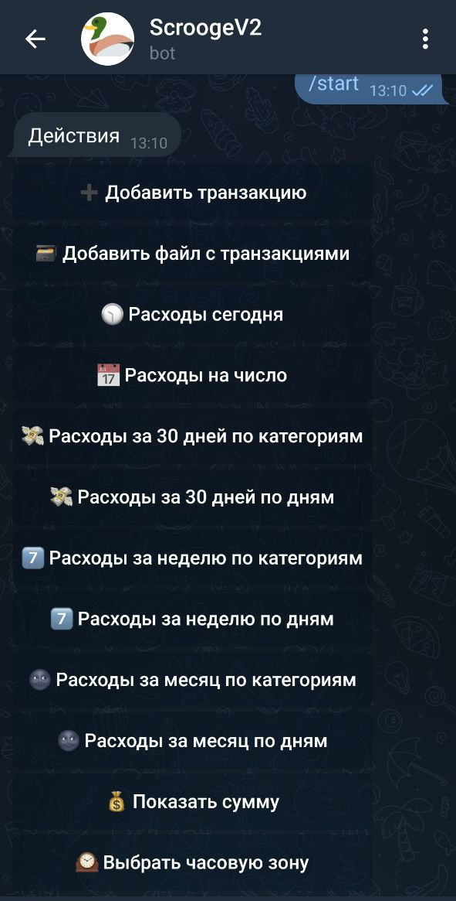

# Scrooge 🦆
Selfhosted assets and expenses service based on Telegram bot

## Features
* Save expenses and profits in different currencies
* Get assets total converted in USD
* Get expeneses reports
* Multiple currencies, stocks and crypto support
* Automatic exhange rates update

## Installation
* Create Telegram bot and get bot key
* Clone repository
* Initialize .env files in root directory, api directory and bot directory
* Run update.sh

## To be done
* English language
* Assets change report